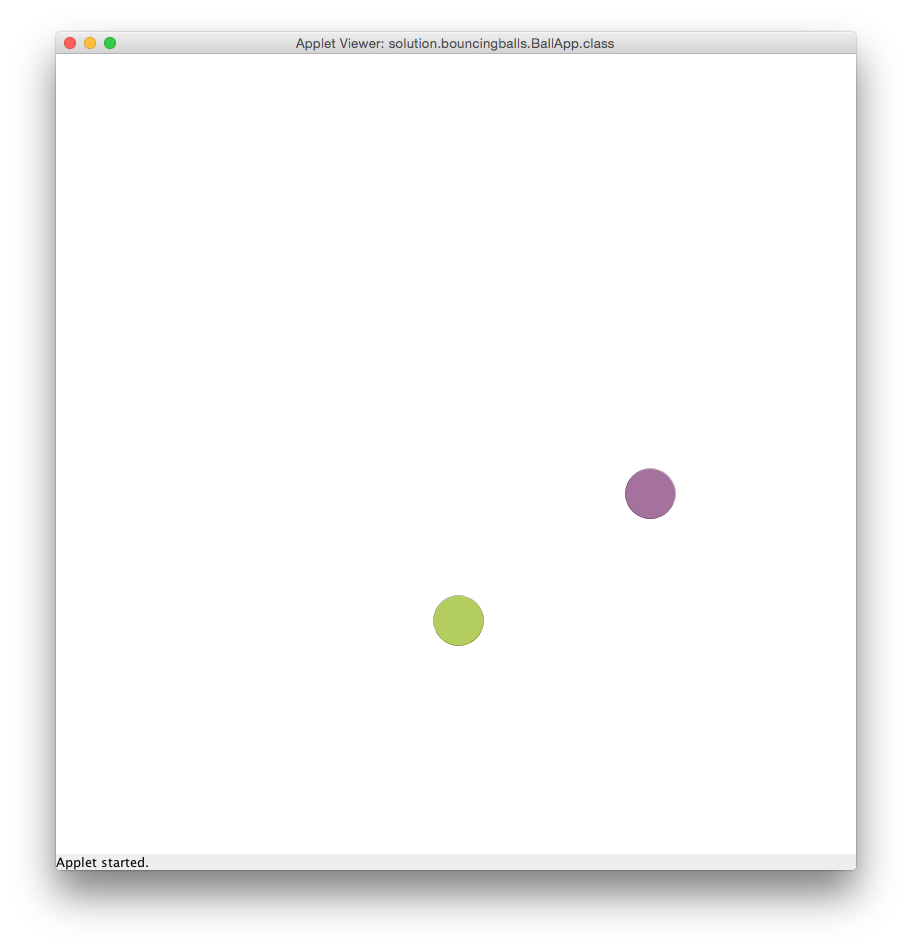
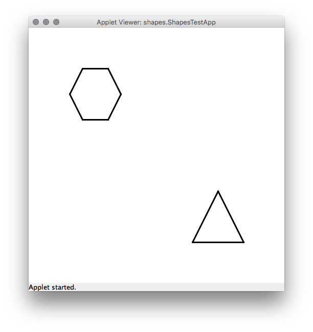

# Template für Übungsaufgaben 

## Wichtige Informationen zur Bearbeitung der Aufgabe 
 - [Informationen zur Entwicklungsumgebung *IntelliJ IDEA*](https://elearning.uni-regensburg.de/mod/book/view.php?id=1480675)
 - [Informationen zum Im- und Export von Projekten](https://elearning.uni-regensburg.de/mod/book/view.php?id=1480675&chapterid=51551)
 - [GraphicsApp](https://elearning.uni-regensburg.de/mod/url/view.php?id=1482162)
 
## Starterpaket

Ein vorbereitetes Starterpaket zur selbständigen Implementierung der Aufgaben finden Sie hier:
 - [Starterpaket](https://github.com/OOP-Ubungen-WS2020-21/U05-GraphicsApp/archive/Starterpaket.zip)

## **Random Bouncing Balls**

In diesem Programm beschäftigen Sie sich mit der Klassenmodellierung im Kontext der GraphicsApp. 
Die Aufgabe ist es, zwei Bälle über die Zeichenfläche zu bewegen und sie 
von den Wänden abprallen zu lassen. Jeder Ball erhält zu Beginn eine zufällige
Geschwindigkeit und Größe sowie eine zufällige Farbe, die sich nach
jeder Kollision mit einer Wand zu einer anderen zufälligen Farbe ändert. Die Bälle selbst prallen nicht voneinander ab. Verwenden Sie die in der Vorlesung vorgestellte Klasse `Random` um die Zufallswerte zu
erzeugen.



**Vorgehen**

Erstellen Sie eine eigene Klasse `RandomBall`, die über die folgenden
Instanzvariablen verfügt:

-   Ein Objekt der Klasse `Ellipse` zum Zeichnen des Balls.

-   Ein Objekt der Klasse `Random`.

-   Variablen (primitive Datentypen) für die Geschwindigkeit in x und y
    Richtung - diese werden bei Objekterzeugung auf Zufallswerte
    gesetzt. Die obere und untere Grenze für diese Werte werden dem
    Konstruktor der Klasse übergeben.

Zusätzlich verfügt die Klasse über zwei Konstanten, die für die
zufällige Auswahl der Größe (bei der Initialisierung) des Balls genutzt
werden sollen:

``` java
private static final int MIN_DIAMETER = 50;
private static final int MAX_DIAMETER = 100;
```

Die Klasse `RandomBall` benötigt die folgenden `public`-Methoden:

-   Einen Konstruktor mit Parametern für die Breite und Höhe der
    Zeichenfläche sowie der oberen und unteren Grenze zur Bestimmung
    der zufälligen Geschwindigkeit. Im Konstruktor wird der
    Zufallsgenerator angelegt um damit die Größe, Farbe und
    Geschwindigkeit des Balls zu bestimmen und ihn an einer zufälligen
    Position zu platzieren.

-   `update` - ändert die Position des `RandomBall` auf der Basis der
    aktuellen Geschwindigkeit

-   `draw` - zeichnet den `RandomBall`

-   `checkWallCollision(int canvasWidth, int canvasHeight)` - überprüft
    ob der Ball mit einer der Wände der Zeichenfläche (bestimmt über die
    Parameter) kollidiert. Berührt der Ball eine der Wände, so werden
    entsprechend Bewegungsrichung (siehe Vorlesungsbeispiel:
    BouncingBall) und Farbe angepasst.

Beachten Sie bitte, dass Sie wahrscheinlich weitere `private`-Methoden
innerhalb der Klasse anlegen müssen, um Ihren Code übersichtlich zu
gestalten.

Zusätzlich zur Klasse `RandomBall` müssen Sie die vorgegebene Klasse
`RandomBouncingBalls` fertig implementieren. In dieser sollen Sie die beiden Objekte der Klasse `RandomBall` erzeugen und die Kollision mit den Seitenwänden überprüfen. Initialisieren Sie die Zeichenfläche und die Bälle in der `initialize`-Methode.\
 (*Decomposition*: Lagern Sie die Teilbereiche der Initialisierung in einzelne Methoden aus, die dann in `initialize` aufgerufen werden)

In der `draw`-Methode werden bei jedem Aufruf der Hintergrund
neu gezeichnet und die beiden Bälle aktualisiert und neu gezeichnet.
Rufen Sie dafür die Methoden zur Kollisionsabfrage, zum *updaten* und
zum Zeichnen in einer sinnvollen Reihenfolge für beide Objekte auf.

## **Eine Bibliotheks-App**

Entwerfen Sie in dieser Aufgabe eine Klassenstruktur, die die Verwaltung
von Medien in einem Bibliothekskatalog abbildet. Der Katalog soll Bücher
und DVDs enthalten können; Ihre Anwendung nutzt die
implementierten Klassen um Medien durch den Benutzer einlesen zu
lassen.


Im ersten Teil der Anwendung werden die nötigen Klassen für die
Mediensammlung entworfen. Erstellen Sie hierzu in einem geeigneten Unterordner in Ihrem Projekt jeweils neue `.java`-Klassendateien:

-   Die Klasse `Media` stellt die Grundstruktur für alle anderen
    Medientypen dar. Eine Klassenvariable (`static`) speichert die
    Anzahl bereits erstellter `Media`-Instanzen und wird im Konstruktor
    entsprechend bei jedem Aufruf inkrementiert. In nicht-öffentlichen
    Instanzvariablen werden eine fortlaufende, numerische ID sowie das
    Erscheinungsjahr und der Titel des Mediums mit passenden Datentypen
    abgebildet. Initiale Werte für diese Eigenschaften werden dem
    Konstruktor übergeben.

    Die gespeicherten Werte können über `getter`-Methoden ausgelesen
    werden. Überschreiben Sie die implizit von `Object` geerbte Methode
    `toString`. Diese soll einen verketteten Text zurückgeben, der
    sowohl die ID als auch den Titel und das Erscheinungsjahr des
    jeweiligen Mediums zurück gibt.

-   Die Klasse `Book` erbt von `Media` und erweitert diese um jeweils
    eine Eigenschaft für den Autoren und die Anzahl der Seiten.
    Verwenden Sie geeignete Instanzvariablen und sorgen Sie dafür, dass
    deren Inhalt über `getter`-Methoden ausgelesen werden kann. Die
    initialen Werte sollen wieder über den Konstruktor übergeben werden.
    Achten Sie beim Implementieren des Konstruktors darauf, dass auch
    die ursprünglichen `Media`-Eigenschaften (Titel und Jahr) als
    Parameter übergeben werden, und dass der eigentliche Konstruktor der
    *Elternklasse* mit diesen Werten aufgerufen wird. Überschreiben Sie
    die `toString`-Methode so, dass auch die zusätzlichen Eigenschaften
    im zurückgegebenen String enthalten sind.

-   Die Klasse `DVD` erbt ebenfalls von `Media`. Implementieren Sie
    diese genau wie `Book`. Anstatt Autorenname und Seitenzahl werden
    hier jedoch die zusätzlichen Eigenschaften Laufzeit (in Minuten) und die Information, ob Bonusmaterial auf der DVD vorhanden ist
    abgebildet.

Im zweiten Teil der Aufgabe wird eine `LibraryApp` erstellt. Erstellen Sie dazu eine neue Java-Klasse mit einer `main`-Methode (Siehe Vorlesung 2, Folie 18 ff.). Das Programm soll dabei
folgende Aufgaben erfüllen:

-   In einem Array vom Typ `Media` werden drei Medien gespeichert.

-   Der Benutzer wird für jede Stelle des Arrays aufgefordert, die Daten
    eines neuen Medium einzugeben. Dabei kann er über eine numerische
    Eingabe auswählen, ob ein Buch oder eine DVD gespeichert werden
    soll.

-   Je nach Auswahl des Nutzers werden anschließend die nötigen
    Informationen über die Konsole eingelesen. Mit den Eingaben wird ein
    entsprechende Objekt vom Typ `Book` oder `DVD` erstellt und im Array
    gespeichert.

-   Nach Eingabe aller Medien wird eine Liste mit dem Inhalt der
    Bibliothek ausgegeben. Iterieren Sie hierzu über das komplette Array
    und rufen Sie für jedes gespeicherte Objekt dessen
    `toString`-Methode auf. Die Rückgabe der Methode wird auf der
    Konsole ausgegeben.

## **Neue Shapes für die GraphicsApp**

Erweitern Sie die Funktionalität der `GraphicsApp` um zwei neue Formen:
Ein gleichschenkliges Dreieck (`Triangle`) sowie ein
Achsen-symmetrisches Sechseck (`Hexagon`). 

Erstellen Sie hierzu zwei `.java`-Klassendateien im Ordner `Shapes` in Ihrem Starterpaket. Beide Formen werden durch Java-Klassen abgebildet, die von `GraphicsObject` erben. Die Darstellung erfolgt in der überschriebenen `draw`-Methode durch
Zeichnen der Umrisslinien. Das Innere der Formen muss nicht eingefärbt
bzw. dargestellt werden. Testen Sie anschließend Ihre Anwendung, in dem
Sie die auskommentierten Zeilen in `ShapesTest` durch Entfernen der
Kommentare nutzbar machen und die Anwendung über den `ShapesTestLauncher` ausführen. Haben Sie die
Klassen korrekt implementiert, sollten Sie die neuen Formen auf dem
Bildschirm sehen. Das Sechseck bewegt sich nach oben links, das Dreieck
nach unten rechts.

**Hinweise:** Speichern Sie in den Klassen die jeweiligen Eckpunkte und
zeichnen Sie beim Aufruf von `draw` die Verbindungslinien zwischen
diesen Punkten. Die Klasse `GraphicsObject` verfügt über Variablen und
Methoden zur Abbildung eines Koordinatenpaars (x und y). Nutzen Sie
diesen Punkt als Zentrum bzw. Schwerpunkt für Ihre neuen Formen und
berechnen Sie die anderen Punkte auf dieser Basis. Denken Sie daran,
dass die verschiedenen Methoden des `GraphicsObject` die x- und
y-Koordinaten beeinflussen und Sie die Eckpunkte Ihrer Form regelmäßig
(z.B. vor jedem Zeichnen) neu berechnen müssen.



